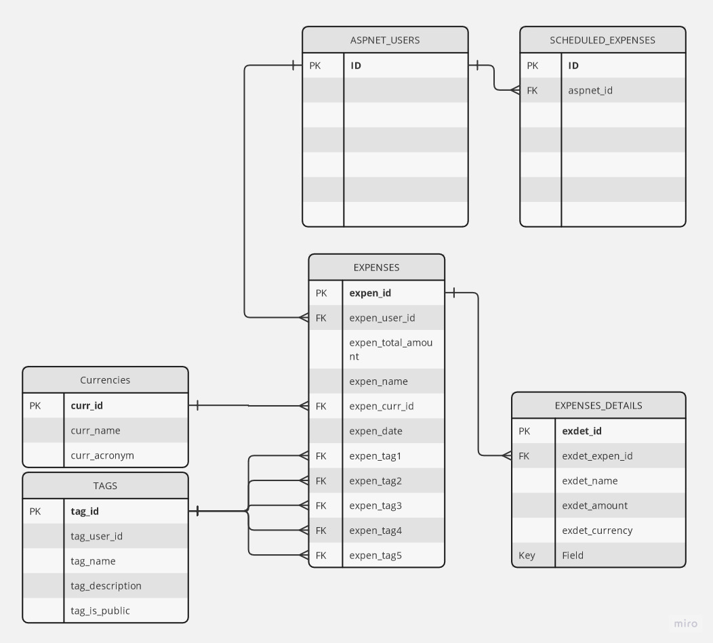
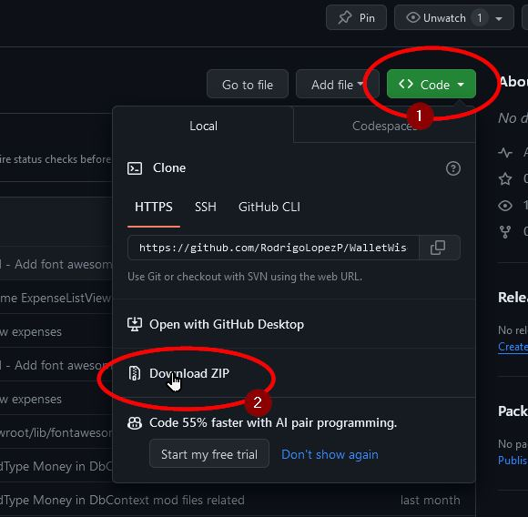

# WalletWise
WalletWise è una webapp che consente a più utenti la registrazione manuale delle loro spese fatte, oltre che al inserimento programmato quelle
ricorrenti.

A ogni spesa possono essere aggiunti 5 tag per poter categorizzare come una spesa di un certo tipo, in questo modo è possibile anche creare delle statistiche mensili per eventuali analisi.

### Backend

- **Linguaggio backend**: C# | ASP .NET MVC
- **Database**: MySQL
- **Provider database** : Entity Framework

### Frontend

- **HTML**
- **CSS** - Bootstrap
- **Razor**
- **JQuery**

## Progettazione database
E' stato usato un approcio _Database First_ per la creazione del database in MySql. Per successive modifiche, ad esempio la creazione della tabella Currencies e per una eventuale aggiunta delle tabelle Identity, viene fatto tramite Migrations. 

*(TO DO: creazione tabella ASPNET_USERS e scheduled expenses)*


# Installazione strumenti
 - Installazione framework - [.NET 7](https://dotnet.microsoft.com/en-us/download/dotnet/7.0)
 - Installazione database relazionale - [MySql 8.34](https://downloads.mysql.com/archives/community)
 - Installazione code editor - [VS Code](https://code.visualstudio.com/Download)
 - Installare [MySql Workbench](https://www.mysql.com/downloads/) o l'estensione [SQLTools](https://marketplace.visualstudio.com/items?itemName=mtxr.sqltools) per VS Code

# Ottenere il codice

```bash
git clone https://github.com/RodrigoLopezP/WalletWise.git
```
Oppure scaricare così



# Ottenere il database

Per ricreare il database su Mysql, controllare [la cartella **docs/database-scripts/**](docs\database-scripts) , eseguire gli script all'interno in ordine crescente
